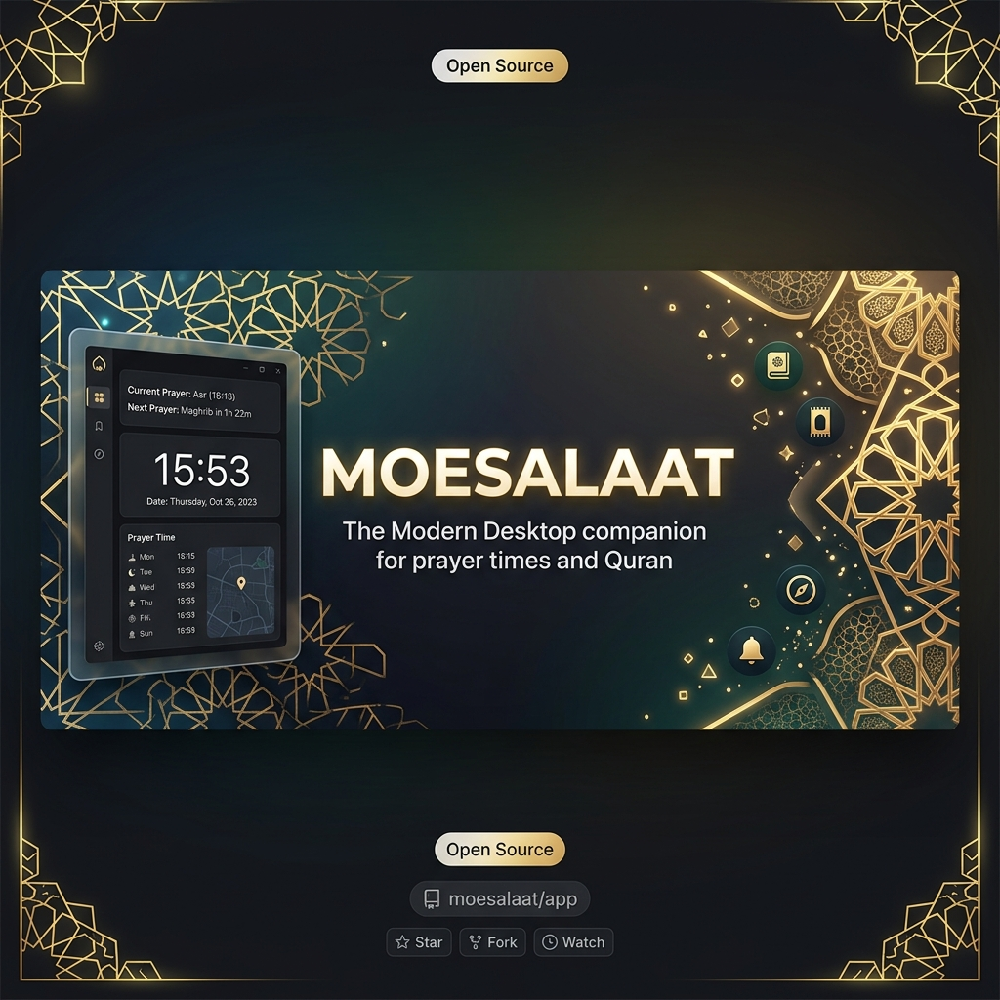

<div align="center">



# 🌙 MOESALAAT Desktop

**A modern, beautifully designed desktop application for Muslims, built with React, TypeScript, Vite, and Tauri v2.**

[](https://github.com/musahabibulloh/MuslimDesktopApp/stargazers)
[](https://github.com/musahabibulloh/MuslimDesktopApp/network/members)
[](https://github.com/musahabibulloh/MuslimDesktopApp/issues)

[**Download Latest Release**](https://github.com/musahabibulloh/MuslimDesktopApp/releases) • [**Report a Bug**](https://github.com/musahabibulloh/MuslimDesktopApp/issues)

</div>

MOESALAAT provides accurate prayer times, a complete Quran with audio, Hijri calendar tracking, and system-level Adhan notifications.


## ✨ Features

- **🕋 Accurate Prayer Times**: 
  - Automatically fetches your current location using High-Accuracy GPS or allows manual search.
  - Calculated using the Ministry of Religion (Kemenag RI) standards by default (Fajr 20°, Isha 18° + 2 mins safety buffer).
  
- **🔔 Adhan Notifications & System Tray**: 
  - Real-time countdown to the next prayer.
  - Automatically plays Makkah Adhan audio and triggers a native system notification when the time arrives.
  - Runs silently in the background (minimizes to System Tray when closed) so you never miss a prayer.

- **📖 The Holy Quran**: 
  - Complete 114 Surahs with Arabic text, Latin transliteration, and Indonesian translation.
  - Listen to Murottal audio (recitations) individually per Ayah.
  - Quick search functionality for Surah names and meanings.

- **📅 Hijri Calendar**: 
  - Interactive calendar for converting Gregorian dates to Hijri.
  - Highlights today's date and important Islamic holidays.

- **🌐 Multi-Language & Theming**: 
  - Supports both Indonesian and English languages out of the box.
  - Gorgeous **Glassmorphism** UI design.
  - Seamless toggle between Light Mode and Dark Mode.

## 🚀 Tech Stack

- **Frontend**: React 19, TypeScript, Vite, Zustand (State Management)
- **Styling**: Vanilla CSS with customized CSS Variables and Glassmorphism utilities
- **Backend / Desktop runtime**: Rust, Tauri v2
- **APIs**: 
  - [equran.id](https://equran.id) (Quran Data)
  - [aladhan.com](https://api.aladhan.com) (Hijri Calendar)
  - OpenStreetMap Nominatim (Geocoding)

## 🛠️ Installation & Development

### Prerequisites
Make sure you have installed Node.js (v18+) and the [Tauri prerequisites](https://v2.tauri.app/start/prerequisites/) for your operating system (Rust, Cargo, etc).

### Setup
1. Clone the repository:
   ```bash
   git clone https://github.com/musahabibulloh/MuslimDesktopApp.git
   cd MuslimDesktopApp
   ```
2. Install dependencies:
   ```bash
   npm install
   ```
3. Run in Development Mode:
   ```bash
   npm run tauri dev
   ```
4. Build the final application (.exe / .app / .deb):
   ```bash
   npm run tauri build
   ```

## 🤝 Contribution
Contributions, issues, and feature requests are always welcome! Feel free to check the [issues page](https://github.com/musahabibulloh/MuslimDesktopApp/issues).

---

*Made with ❤️ for the Muslim Developer Community.*
